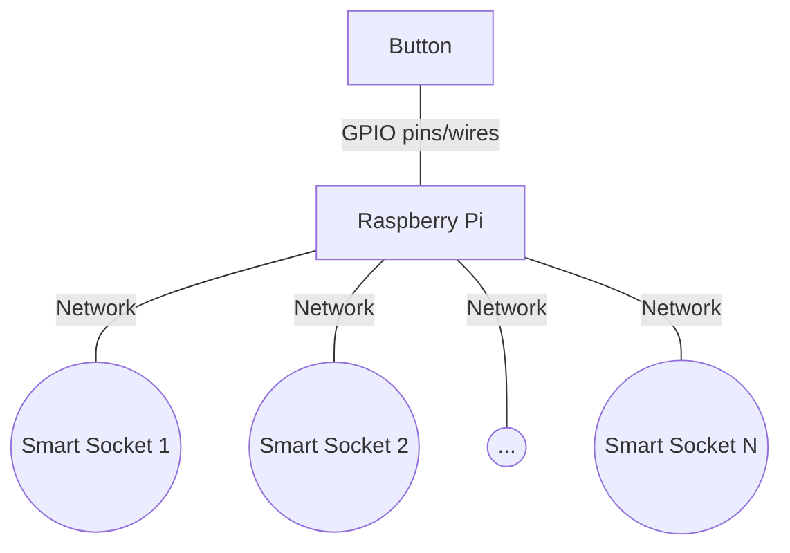

## Introduction

Light Switch is a "home automation" project for controling lights inside a house.
The project uses a button connected to a Raspberry Pi,
which sends REST API commands to smart sockets via HTTP/TCP/IP/Ethernet/WiFi.




## Installation

1. Place `light_switch.py` on the Raspberry Pi, on `/home/pi/projects_pi/light_switch/`.
1. Place `light_switch.service` on the Raspberry Pi, on `/etc/systemd/system/`.
1. Enable the service to start on boot:
    ```
    sudo systemctl enable light_switch.service
    ```


## Limitations

The project relies on multiple hard-coded values and assumptions:

* Directory structure on the Raspberry Pi
* The GPIO pin on which the button is connected
* Specific IP addresses of devices to be controlled
* etc.

These can easily be tailored to specific needs.
