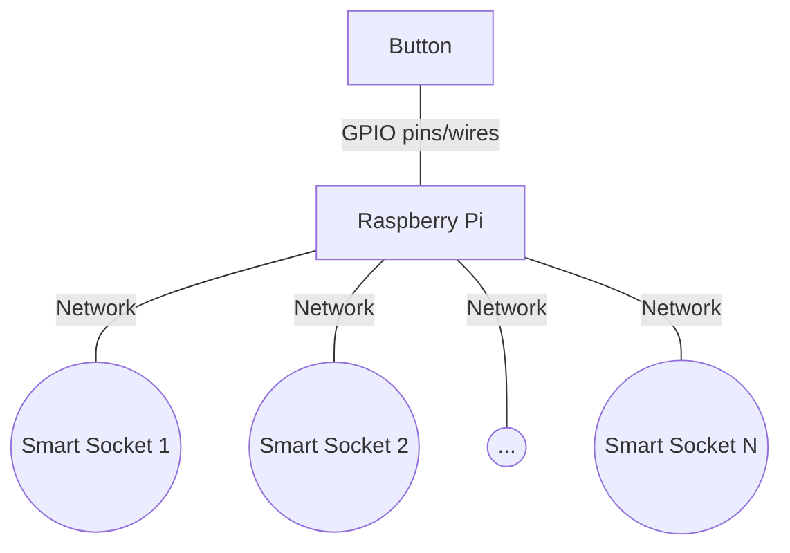

# Introduction

Light Switch is a "home automation" project for controling lights inside a house.
The project uses a button connected to a Raspberry Pi,
which sends REST API commands to smart sockets via HTTP/TCP/IP/Ethernet/WiFi.
Raspberry Pi Zero is a particularly convenient variant,
since it has built-in WiFi capabilities.



# Configuration

The script configuration is stored inside a `config.ini` file,
which consists of the following fields:

* `button_gpio`: The GPIO pin number to which the button is attached.
* `sockets`: A list of IP addresses of the smart sockets.

See `example_config.ini` for an example configuration.

In case that you use different paths than those specified in the installation section,
modify the paths in the `light_switch.service` file accordingly.


# Installation

1. Place `light_switch.py` on the Raspberry Pi, on `/home/pi/projects_pi/light_switch/`.
1. Place `light_switch.service` on the Raspberry Pi, on `/etc/systemd/system/`.
1. Create a configuration file `config.ini`, and place it next to `light_switch.py`.
1. Enable the service to start on boot:
    ```
    sudo systemctl enable light_switch.service
    ```